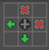

# Unity 3D Tilemap Custom Rule Fix

This repository provides a custom script to address specific issues with **TilingRuleOutput.Transform** options in Unity's 3D Tilemap. If you encountered problems with certain transformation rules not working as expected, this fix is for you.

---

## Issues with Tiling Rules

When using Unity's 3D Tilemap, the following transformation rules often do not behave as intended:

- **Rotated:** Incorrect or incomplete rotation application.  
  

- **RotatedMirror:** Inconsistent rendering when combining rotation and mirroring.  
  

- **MirrorXY:** Overlaps or misalignment when mirroring along both X and Y axes.  
  

- **MirrorY:** Incorrect flipping along the Y-axis.  
  

Below are additional examples illustrating the general problem and how this script addresses it:

### RuleTile Settings
Example settings for the RuleTile that may exhibit issues:  


### Issue Example
A sample of a tilemap with misaligned or incorrect tile transformations:  


### Fixed Example
The same tilemap after applying the custom script:  


---

## How to Use

1. Download the script file: [CustomRuleTile.cs](Scripts/CustomRuleTile.cs).  
2. Add the script to your Unity project by placing it in your `Assets/Scripts` folder (or any preferred folder).  
3. Replace your existing RuleTile with the custom `CustomRuleTile` in the Unity Editor.
4. Use the custom RuleTile in your tilemap to resolve transformation issues.

> [!NOTE]  
> The provided script extends Unity's `RuleTile` class and overrides its transformation logic to fix the mentioned issues.

---

### Script Overview

This custom script overrides Unity's default `RuleTile` behavior to correctly handle all transformations, ensuring accurate rendering for tiles with rotation, mirroring, and combination transformations.  

```csharp
using System.Collections;
using System.Collections.Generic;
using UnityEngine;
using UnityEngine.Tilemaps;

[CreateAssetMenu]
public class CustomRuleTile : RuleTile {

    public override bool RuleMatches(TilingRule rule, Vector3Int position, ITilemap tilemap, ref Matrix4x4 transform)
    {
        // Custom logic for handling transformations like Rotated, MirrorXY, etc.
        // Full code provided in the repository
        ...
    }
}
